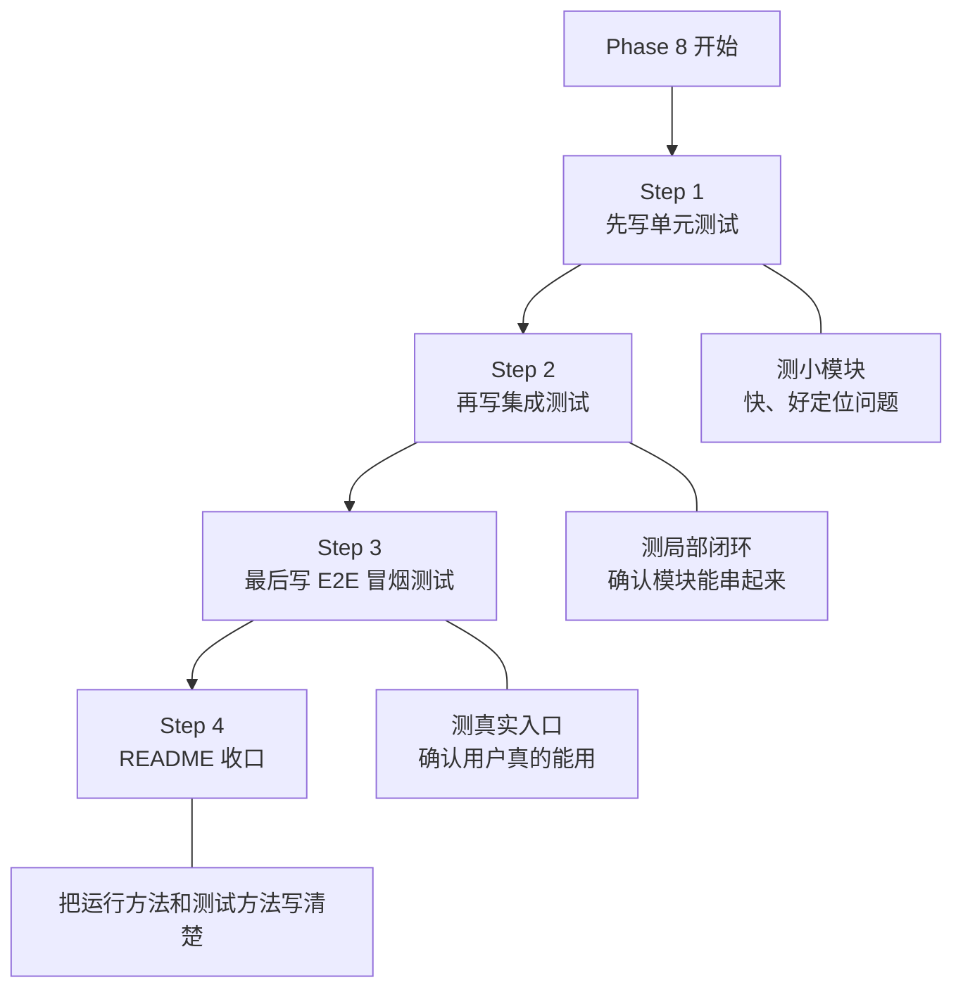

# Phase 8 测试顺序图

这份文档只解决一个问题：

> `Phase 8` 到底应该先写哪个测试，再写哪个测试？

不要把 `Phase 8` 理解成“一口气把所有测试全补上”。  
正确做法是：

- 先测小模块
- 再测局部闭环
- 最后测真实入口

---

## 一张图先看顺序



---

## 为什么要按这个顺序

如果你一上来就先跑 E2E，很容易遇到这种情况：

- 出错了
- 但你不知道是哪个模块坏了
- 然后你会开始同时改很多地方
- 最后越改越乱

所以最稳的顺序一定是：

1. 先测最小模块
2. 再测组合起来的局部链路
3. 最后才测完整入口

---

## Step 1：先写单元测试

这一层只测“纯模块逻辑”，不追求全链路。

建议先写这些：

### 1. `chunker`

目标：

- 能正确切块
- `chunk_size` 生效
- `chunk_overlap` 生效
- `chunk_id` 稳定

建议文件：

- `tests/unit/test_chunker.py`

---

### 2. `bm25_indexer`

目标：

- build 成功
- query 能返回结果
- rebuild 能重建
- delete 后索引文件能消失

建议文件：

- `tests/unit/test_bm25_indexer.py`

---

### 3. `fusion`

目标：

- Dense + Sparse 两路结果能正确做 RRF
- 同一 chunk 的分数会合并
- 排序稳定

建议文件：

- `tests/unit/test_fusion.py`

---

### 4. `query_processor`

目标：

- 查询清洗正确
- 关键词提取正确
- 简单 `key:value` filter 能解析

建议文件：

- `tests/unit/test_query_processor.py`

---

## Step 2：再写集成测试

这一层测“局部闭环”，也就是多个模块串起来是否真的工作。

建议先写这些：

### 1. 摄取链路集成测试

目标：

```text
PDF -> Loader -> Chunker -> Embedding -> BM25 -> Chroma
```

验证点：

- ingest 成功
- BM25 有数据
- Chroma 有数据

建议文件：

- `tests/integration/test_ingestion_pipeline.py`

---

### 2. 查询链路集成测试

目标：

```text
query -> Dense + Sparse -> Fusion -> Response
```

验证点：

- Dense 能返回结果
- Sparse 能返回结果
- Fusion 能返回最终结果

建议文件：

- `tests/integration/test_query_workflow.py`

---

### 3. 文档删除集成测试

目标：

```text
delete document -> remove chroma -> rebuild bm25
```

验证点：

- 删除前能查到
- 删除后 Chroma count 下降
- 删除后 BM25 重建成功
- 删除后 collection 为空时能清掉

建议文件：

- `tests/integration/test_document_manager.py`

---

## Step 3：最后写 E2E 冒烟测试

这一层不是为了测细节，而是为了测：

> 用户真实会用的入口，现在到底能不能跑。

建议优先写这些：

### 1. `scripts/ingest.py`

目标：

- 命令能跑
- 输出合理
- 返回码正确

---

### 2. `scripts/query.py`

目标：

- 查询命令能跑
- 能输出最终结果

---

### 3. `scripts/evaluate.py`

目标：

- 能跑 Golden Set
- 能产出评估报告

---

### 4. `scripts/mcp_server.py`

目标：

- `initialize`
- `tools/list`
- `tools/call`

---

### 5. `scripts/start_dashboard.py`

目标：

- 六页都能打开
- 页面没有异常

建议目录：

- `tests/e2e/`

---

## Step 4：最后写 README

README 不要太早写。  
等测试基本稳定后再写，最省返工。

建议至少写清楚这些：

- 这是个什么项目
- 当前实现了哪些能力
- 怎么安装依赖
- 怎么运行 ingest
- 怎么运行 query
- 怎么启动 Dashboard
- 怎么启动 MCP Server
- 怎么跑 evaluate
- 怎么跑测试

---

## 推荐的实际执行顺序

直接按下面这张表做最稳：

1. `tests/unit/test_chunker.py`
2. `tests/unit/test_bm25_indexer.py`
3. `tests/unit/test_fusion.py`
4. `tests/unit/test_query_processor.py`
5. `tests/integration/test_ingestion_pipeline.py`
6. `tests/integration/test_query_workflow.py`
7. `tests/integration/test_document_manager.py`
8. `tests/e2e/test_ingest_cli.py`
9. `tests/e2e/test_query_cli.py`
10. `tests/e2e/test_evaluate_cli.py`
11. `tests/e2e/test_mcp_smoke.py`
12. `tests/e2e/test_dashboard_smoke.py`
13. `README.md`

---

## 一句话记忆

你只要记住这个顺序：

```text
先测小模块
-> 再测局部闭环
-> 最后测真实入口
-> 最后写 README
```

---

## 现在最该做什么

如果马上进入 `Phase 8`，最推荐的起点是：

> 先写 `test_chunker.py`

因为它最小、最容易、最适合建立测试节奏。
