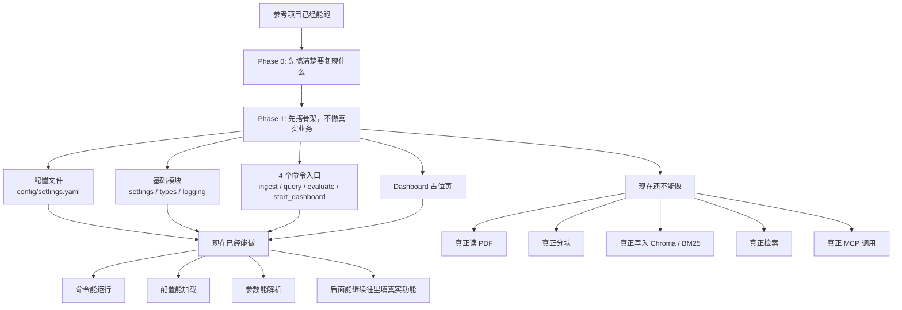

# 第一阶段图解

## 第一阶段在干什么

第一阶段不是在实现真正的业务功能，而是在把“复现版项目的骨架”先搭起来。

你可以把它理解成：

- 先把项目目录和入口建好
- 先把配置加载建好
- 先把基础数据类型建好
- 先把后面要用的 4 个命令入口建好
- 先让这些入口至少能运行、能解析参数、能加载配置

这一步的目标不是“已经能做 RAG 检索”，而是“后面终于有地方可以继续写功能了”。

## 一图看懂



## 这一步已经完成了什么

### 1. 配置文件

已经有复现版自己的配置文件：

- `repro/config/settings.yaml`

它的作用是先把后面会用到的配置结构定下来，包括：

- `llm`
- `embedding`
- `vision_llm`
- `vector_store`
- `retrieval`
- `rerank`
- `evaluation`
- `observability`
- `ingestion`

### 2. 基础模块

已经有复现版自己的基础模块：

- `repro/src/modular_rag_repro/settings.py`
- `repro/src/modular_rag_repro/types.py`
- `repro/src/modular_rag_repro/logging_utils.py`

它们现在负责：

- 加载配置
- 定义核心数据结构
- 初始化日志

### 3. 四个命令入口

已经建好的命令入口：

- `repro/scripts/ingest.py`
- `repro/scripts/query.py`
- `repro/scripts/evaluate.py`
- `repro/scripts/start_dashboard.py`

它们现在还只是骨架，但已经能：

- 解析参数
- 加载配置
- 打印当前阶段信息
- 作为后面真实功能的入口

### 4. Dashboard 占位页

已经有最小 Dashboard 占位页：

- `repro/src/modular_rag_repro/dashboard/app.py`

它的作用是先把启动链路打通，后面再补真正的页面内容。

## 这一步还没做什么

第一阶段还没有开始实现真正的 RAG 能力，所以现在还不能：

- 真的读取 PDF
- 真的切 chunk
- 真的生成 embedding
- 真的写入 Chroma
- 真的建立 BM25
- 真的查询知识库
- 真的启动 MCP 工具服务

所以这一步的正确理解是：

`骨架已完成，业务未开始。`

## 你怎么手动验证这一步是否可行

当前推荐直接在 `repro/` 目录下，使用外层项目已经可用的 `.venv`：

```powershell
cd "D:\OneDrive - stu.scau.edu.cn\桌面\workspace\MODULAR-RAG-MCP-SERVER\repro"
..\.venv\Scripts\python.exe scripts\ingest.py --help
..\.venv\Scripts\python.exe scripts\query.py --help
..\.venv\Scripts\python.exe scripts\evaluate.py --help
..\.venv\Scripts\python.exe scripts\start_dashboard.py --help
```

如果这些命令都能正常输出帮助信息，就说明：

- 脚本入口没坏
- 参数解析没坏
- 基础导入路径没坏

你还可以再跑 3 个最小主流程：

```powershell
..\.venv\Scripts\python.exe scripts\ingest.py --path demo.pdf --collection demo --dry-run
..\.venv\Scripts\python.exe scripts\query.py --query "test query" --collection demo --top-k 3
..\.venv\Scripts\python.exe scripts\evaluate.py --test-set tests/fixtures/golden_test_set.json --collection demo --top-k 3 --no-search
```

如果能正常打印骨架输出而不报错，就说明第一阶段是可行的。

## 一句话总结

第一阶段的本质是：

`先把复现版项目的“壳子、入口、配置、基础类型”搭起来。`

只有这一步完成了，第二阶段才能开始真正做：

`PDF -> Loader -> Chunker -> Chroma/BM25`
