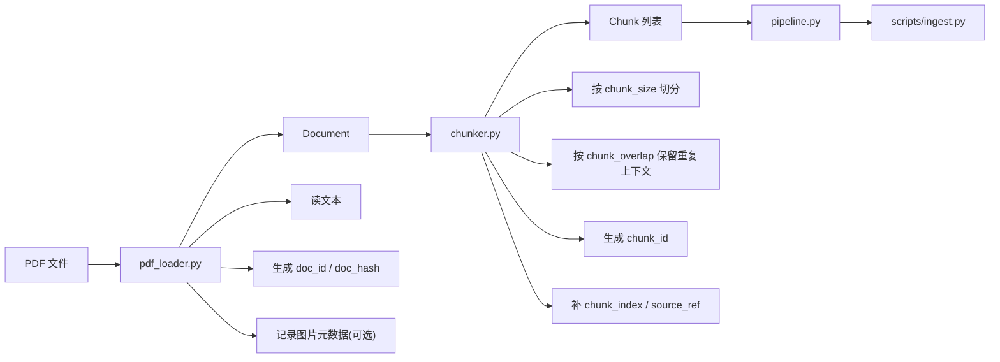

# 第二阶段图解

## 第二阶段在干什么

第二阶段开始做真正的业务功能。

它的目标不是一下子把整个 RAG 都做完，而是先把“摄取链路”从前往后打通：

```text
PDF -> Loader -> Chunker -> Pipeline -> ingest.py
```

你可以把第二阶段理解成：

- 先把 PDF 读出来
- 再把整篇文档切成多个 chunk
- 再用一个 pipeline 把这两步串起来
- 最后让 `scripts/ingest.py` 真正调用这条链路

## 一图看懂



## 现在已经做到哪里

第二阶段当前已经做了前两步：

### 1. `pdf_loader.py`

文件：

- `repro/src/modular_rag_repro/ingestion/pdf_loader.py`

作用：

- 把 PDF 读成 `Document`

当前已经能做：

- 校验是不是 PDF
- 提取文本
- 计算 `doc_hash`
- 生成 `doc_id`
- 生成基础 metadata
- 识别图片元数据

你可以把它理解成：

```text
PDF -> Document
```

### 2. `chunker.py`

文件：

- `repro/src/modular_rag_repro/ingestion/chunker.py`

作用：

- 把 `Document` 切成多个 `Chunk`

当前已经能做：

- 使用 `chunk_size`
- 使用 `chunk_overlap`
- 优先按段落切分
- 段落太长时退化成固定窗口切分
- 给每个 chunk 生成稳定 `chunk_id`
- 继承文档 metadata
- 补 `chunk_index` / `source_ref` / `char_length`

你可以把它理解成：

```text
Document -> [Chunk, Chunk, Chunk]
```

## 这一步还没做什么

第二阶段目前还没完成：

- `pipeline.py`
- `scripts/ingest.py` 真正接入 pipeline
- embedding
- BM25
- Chroma 入库

也就是说，现在能做到的是：

```text
PDF -> Document -> Chunks
```

还没做到：

```text
PDF -> Document -> Chunks -> 向量库 / BM25
```

## 你怎么手动测试当前第二阶段

### 测 `pdf_loader.py`

```powershell
cd "D:\OneDrive - stu.scau.edu.cn\桌面\workspace\MODULAR-RAG-MCP-SERVER\repro"
..\.venv\Scripts\python.exe -c "from pathlib import Path; import sys; sys.path.insert(0, str(Path('src').resolve())); from modular_rag_repro.ingestion import PdfLoader; doc = PdfLoader(extract_images=True).load(Path('..') / 'tests' / 'fixtures' / 'sample_documents' / 'simple.pdf'); print(doc.id); print(len(doc.text)); print(doc.metadata['title'])"
```

如果能看到：

- `doc_xxx`
- 文本长度数字
- 标题

就说明 `pdf_loader.py` 是通的。

### 测 `chunker.py`

```powershell
cd "D:\OneDrive - stu.scau.edu.cn\桌面\workspace\MODULAR-RAG-MCP-SERVER\repro"
..\.venv\Scripts\python.exe -c "from pathlib import Path; import sys; sys.path.insert(0, str(Path('src').resolve())); from modular_rag_repro.settings import load_settings; from modular_rag_repro.ingestion import PdfLoader, DocumentChunker; settings = load_settings(); settings.ingestion.chunk_size = 120; settings.ingestion.chunk_overlap = 20; doc = PdfLoader(extract_images=False).load(Path('..') / 'tests' / 'fixtures' / 'sample_documents' / 'simple.pdf'); chunks = DocumentChunker(settings).split_document(doc); print(len(chunks)); print(chunks[0].id); print(chunks[0].metadata['chunk_index'])"
```

如果能看到：

- chunk 数量
- 第一个 chunk 的 ID
- `chunk_index`

就说明 `chunker.py` 是通的。

## 一句话总结

第二阶段现在的进度是：

```text
已经打通：PDF -> Document -> Chunks
还没打通：Chunks -> 向量库 / BM25
```

下一步最自然的文件就是：

- `pipeline.py`

也就是把 `pdf_loader.py` 和 `chunker.py` 真正串起来。
