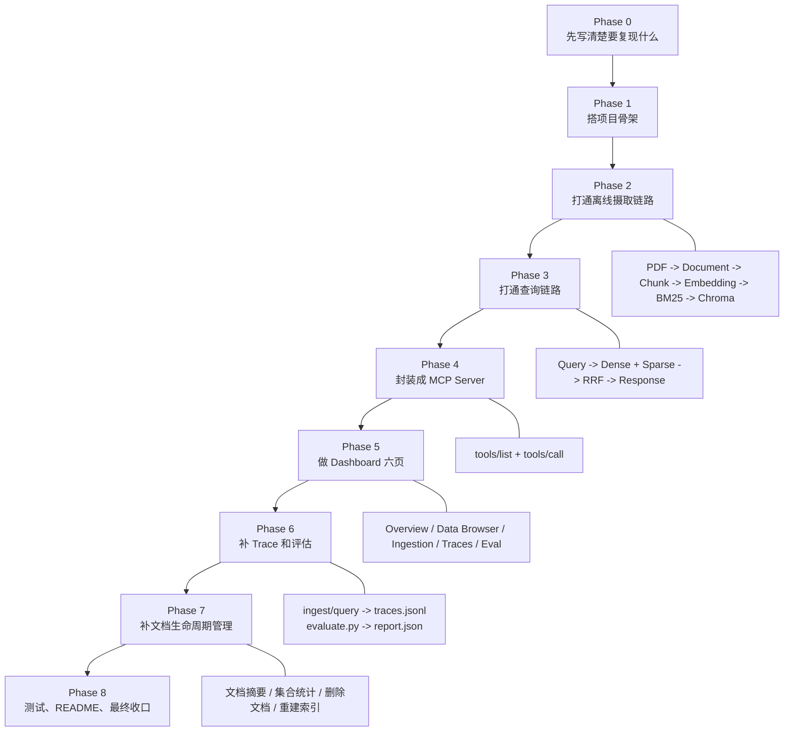

# 阶段总览图

这份文档用来快速回答两个问题：

- 复现版现在已经做到哪一步了
- 每个阶段到底做了什么

---

## 一张图看全流程



---

## 每个阶段在做什么

### Phase 0：先把目标说清楚

这一阶段不写业务代码，只做规划。

目的：

- 明确要复现哪些功能
- 明确每个功能怎么验收
- 避免后面边写边偏

产物：

- `复现规划.md`
- `复现任务清单.md`
- `功能矩阵.md`
- `验收矩阵.md`

---

### Phase 1：搭项目骨架

这一阶段的目标不是“实现功能”，而是先把项目壳子立起来。

主要完成：

- 配置加载
- 日志初始化
- 核心类型
- 4 个脚本入口
  - `scripts/ingest.py`
  - `scripts/query.py`
  - `scripts/evaluate.py`
  - `scripts/start_dashboard.py`

一句话理解：

> 先把门、窗、开关、电表装好，还没有开始搬家具。

---

### Phase 2：打通离线摄取链路

这是第一个真正开始做业务的阶段。

这一阶段把下面这条链路打通：

```text
PDF -> Document -> Chunks -> Embeddings -> BM25 -> Chroma
```

主要完成：

- `pdf_loader.py`
- `chunker.py`
- `embedding_encoder.py`
- `bm25_indexer.py`
- `chroma_upserter.py`
- `pipeline.py`

一句话理解：

> 这一步让系统先“吃得进去文档”。

---

### Phase 3：打通查询链路

这一阶段把“查”做通。

这一阶段打通：

```text
query -> QueryProcessor -> Dense + Sparse -> RRF -> Response
```

主要完成：

- `query_processor.py`
- `dense_retriever.py`
- `sparse_retriever.py`
- `fusion.py`
- `response_formatter.py`

一句话理解：

> 这一步让系统先“查得出来结果”。

---

### Phase 4：封装成 MCP Server

这一阶段不是新增查询能力，而是把已有能力通过 MCP 协议暴露出去。

主要完成：

- `server.py`
- `protocol_handler.py`
- 3 个工具
  - `query_knowledge_hub`
  - `list_collections`
  - `get_document_summary`

一句话理解：

> 这一步让别的 AI 客户端也能把你的知识库当工具来调用。

---

### Phase 5：做 Dashboard 六页

这一阶段做可视化，不追求花哨，先追求“真能看数据”。

主要页面：

- Overview
- Data Browser
- Ingestion Manager
- Ingestion Traces
- Query Traces
- Evaluation Panel

一句话理解：

> 这一步让你不只是能跑命令，还能从页面看到系统状态。

---

### Phase 6：补 Trace 和评估

这一阶段解决的问题是：

> 你怎么证明系统真的做了什么？

主要完成：

- `TraceCollector`
- ingest/query trace 写入
- `evaluate.py`
- Golden Set Runner
- 评估报告输出

落地结果：

- `logs/traces.jsonl`
- `data/evaluation/*.json`

一句话理解：

> 这一步让系统从“能跑”变成“可观察、可验证”。

---

### Phase 7：补文档生命周期管理

这一阶段解决的是“数据管理”问题。

主要完成：

- 集合统计
- 文档摘要
- 文档删除
- 索引重建钩子

现在删除一个文档时，会同步清理：

- Chroma 向量
- BM25 索引

如果 collection 被删空，还会顺手清掉空 collection。

一句话理解：

> 这一步让系统不仅能加数据，也能真正管理数据。

---

### Phase 8：测试、README、最终收口

这一阶段还没做完，是当前剩下的最后一步。

主要要做：

- 单元测试
- 集成测试
- E2E 冒烟测试
- README 收口

一句话理解：

> 这一步是把“自己能跑”整理成“别人拉下来也能跑”。

---

## 当前进度

当前已经完成：

- Phase 0
- Phase 1
- Phase 2
- Phase 3
- Phase 4
- Phase 5
- Phase 6
- Phase 7

当前未完成：

- Phase 8

---

## 现在这套复现版已经具备的能力

- 导入 PDF
- 文本分块
- 生成 Embedding
- 建 BM25
- 写入 Chroma
- Dense 检索
- Sparse 检索
- RRF 融合
- 命令行查询
- MCP 工具调用
- Dashboard 六页
- Trace 记录
- Golden Set 评估
- 文档摘要
- 文档删除
- 索引重建

---

## 最后一句话

你现在可以把整个复现版理解成：

> 一个已经完成了“摄取、检索、工具化、可视化、可观测、可管理”的最小可用 Modular RAG 系统。

剩下的主要就是测试和文档收口。
